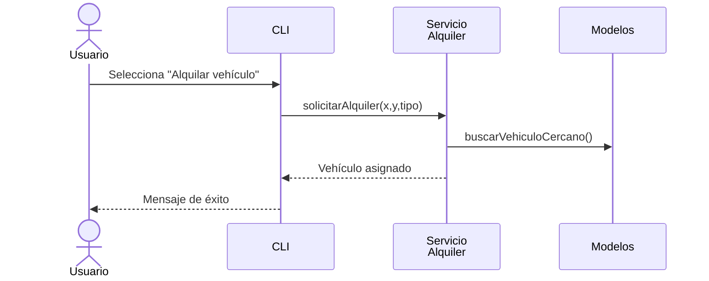

# 1. Análisis de la aplicación

## 1.1 Objetivos

El objetivo principal de *MobilityX* es ofrecer una plataforma académica que
permita poner en práctica los principios de la Programación Orientada a Objetos
(POO) mediante la simulación de un sistema de movilidad compartida. Entre las
funcionalidades requeridas se encuentran:

* Gestión de distintos **tipos de vehículos** (bicicleta, patinete, moto) y sus
  bases de estacionamiento.
* **Alquiler** y devolución de vehículos por parte de usuarios.
* Registro de **usuarios estándar y premium**, con historial de uso y gasto.
* **Mantenimiento** de la flota a cargo de trabajadores.
* Obtención de **estadísticas** de demanda, uso y mantenimiento.

## 1.2 Arquitectura

La solución se ha estructurado en **tres capas** lógicas:

| Capa | Paquete | Responsabilidad |
|------|---------|-----------------|
| **Dominio** | `com.mobilityX.models` | Entidades de negocio puras y sus relaciones. |
| **Servicios** | `com.mobilityX.services` | Reglas de negocio y orquestación. |
| **Presentación** | `movilidad` & `CLI` | Interfaz de usuario en línea de comandos. |

Cada capa se comunica con la inmediata inferior, favoreciendo la separación de
responsabilidades y la facilidad de pruebas unitarias.

## 1.3 Flujo de ejecución



## 1.4 Decisiones de diseño

| Decisión | Motivación | Impacto |
|----------|------------|---------|
| **Enumeraciones tipadas** para TipoVehiculo | Evita *strings* mágicos | Mejor mantenimiento y type-safety |
| **Listas inmutables** para catálogos | Concurrencia segura y simplicidad | Evita modificaciones accidentales |
| Separación de **modelo/servicio** | SRP y testabilidad | Test unitarios aislados |
| **CLI** minimalista | Cumplir requisitos sin sobre-ingeniería | Rápida interacción |
| Uso de **Math.hypot** para distancia | Claridad y precisión | Código legible |

---

# 2. Diagrama de clases

El diagrama en formato SVG se genera automáticamente con **UMLDoclet** y se
encuentra en la carpeta `target/site/apidocs`. 

Las relaciones principales del sistema son:

* **Herencia**: Las clases `Bicicleta`, `Patinete` y `Moto` heredan de la clase abstracta `Vehiculo`.
* **Agregación**: La clase `Base` contiene una colección de objetos `Vehiculo`.
* **Uso**: Los servicios como `AlquilerService` utilizan las clases de modelo para implementar la lógica de negocio.

A continuación se describe el diagrama de clases textualmente:

```
Vehiculo (abstracta)
  |
  |-- Bicicleta
  |-- Patinete
  |-- Moto

Base o-- Vehiculo (1 a muchos)

Usuario
  |
  |-- UsuarioPremium

Trabajador
  |
  |-- Administrador

Servicios:
- AlquilerService --> Base, Vehiculo
- MantenimientoService --> Trabajador, Vehiculo
- StatsService --> Base, Usuario, Trabajador
- AdminService --> Usuario, Trabajador
```

Esta estructura refleja claramente la organización orientada a objetos del sistema.

---

# 3. Descripción de clases y objetos

| Clase | Paquete | Propósito | Métodos públicos destacados |
|-------|---------|-----------|-----------------------------|
| `Vehiculo` *(abstracta)* | `models.vehicle` | Factor común a todos los vehículos. | `mover(x,y)`, `getTiempoUsoMinutosTotal()` |
| `Bicicleta` | `models.vehicle` | Vehículo sin batería. | hereda lo básico |
| `Patinete` | `models.vehicle` | Vehículo con batería. | `getBateria()` |
| `Moto` | `models.vehicle` | Añade `cilindrada`. | `getCilindrada()` |
| `Base` | `models.vehicle` | Punto físico de aparcamiento. | `agregarVehiculo()`, `calcularDemanda()` |
| `Usuario` | `models.user` | Cliente básico. | `alquilar()`, `devolver()` |
| `UsuarioPremium` | `models.user` | Ventajas adicionales. | `getDescuento()` |
| `Trabajador` | `models.worker` | Base para empleados. | `registrarIntervencion()` |
| `Administrador` | `models.worker` | Gestiona personal. | `añadirTrabajador()` |
| `AlquilerService` | `services` | Lógica de alquiler. | `basesMasCercanas()`, `alquilarVehiculo()` |
| `StatsService` | `services` | Estadísticas. | `basesPorDemanda()` |
| `movilidad` | raíz | Método `main`. | `main()` |
| `CLI` | `com.mobilityX` | Interfaz. | `loop()` |

---

# 4. Estrategias implementadas

* **Búsqueda eficiente de cercanía**: ordenación con *stream* y `Comparator`
  basado en la distancia euclidiana.
* **Gestión de demanda dinámica**: cada alquiler incrementa un contador en `Base`.
* **Patrones de diseño**: se emplea **Factory Method** implícito en
  `AlquilerService` para instanciar vehículos del tipo solicitado.
* **Pruebas unitarias** (JUnit 4): cubren lógica de alquiler y estadísticas.

---

# 5. Compilación y ejecución

```bash
# Compilar el proyecto
mvn clean compile

# Ejecutar la aplicación
mvn exec:java -Dexec.mainClass="movilidad"

# Generar JAR ejecutable
mvn package
java -jar target/mobility-x-1.0-SNAPSHOT.jar

# Generar diagramas UML y JavaDoc
mvn javadoc:javadoc
```

---

# 6. Anexo – Código fuente

Se adjuntan todos los ficheros `.java` y `.class` en la carpeta `codigo/`. A
modo ilustrativo, se muestra la clase principal:

```java
public class movilidad {
    public static void main(String[] args) {
        com.mobilityX.CLI cli = new com.mobilityX.CLI();
        cli.loop();
    }
}
```

<!-- Fin del documento -->